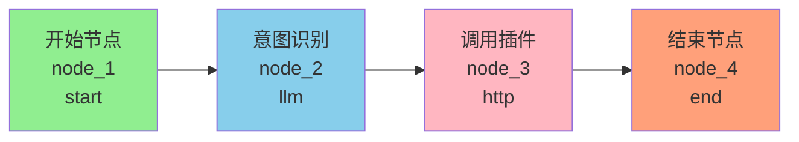
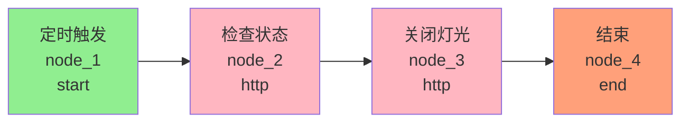
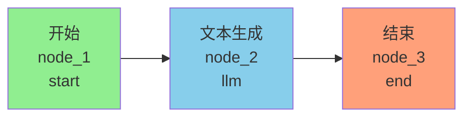
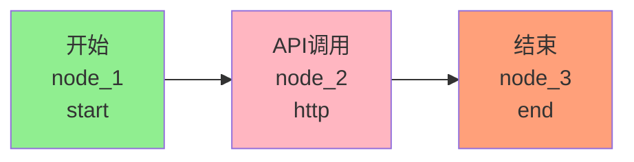
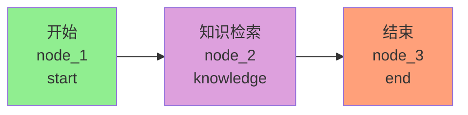
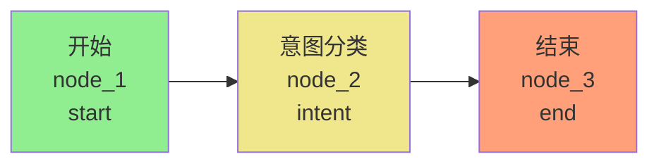
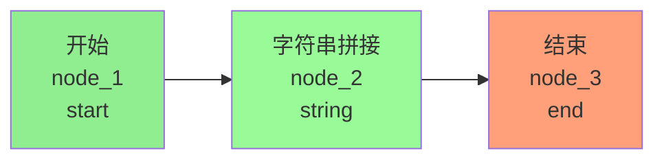
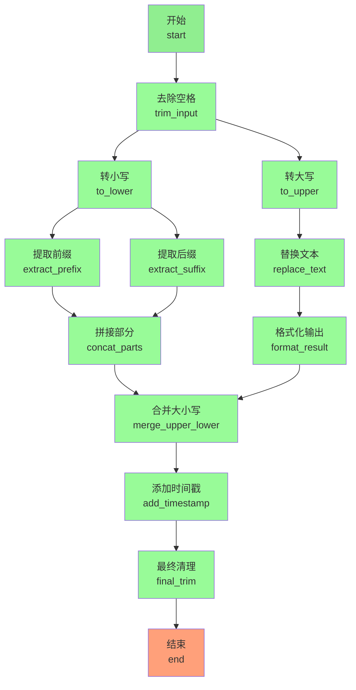

# 工作流执行引擎实现文档

## 概述

本工作流执行引擎实现了基于节点的工作流系统，支持多种节点类型，使用线程池进行任务管理，节点串行执行。

## 架构设计

### 核心组件

1. **节点配置类（Node Config）**
   - `BaseNodeConfig`: 所有节点配置的基类
   - 各节点类型配置类：`StartNodeConfig`, `EndNodeConfig`, `LLMNodeConfig`, `HttpNodeConfig`, `KnowledgeNodeConfig`, `IntentNodeConfig`, `StringNodeConfig`
   - `NodeConfigFactory`: 根据节点类型创建对应的配置对象

2. **节点执行器（Node Executor）**
   - `NodeExecutor`: 节点执行器接口
   - 各节点类型执行器：`StartNodeExecutor`, `EndNodeExecutor`, `LLMNodeExecutor`, `HttpNodeExecutor`, `KnowledgeNodeExecutor`, `IntentNodeExecutor`, `StringNodeExecutor`

3. **变量解析器（Variable Resolver）**
   - `VariableResolver`: 支持 `{node_id}`, `{node_id.field}`, `{input.param}` 格式的变量替换

4. **工作流执行引擎（Workflow Executor）**
   - `WorkflowExecutor`: 使用线程池管理工作流执行任务，支持同步和异步执行
   - `ExecutionContext`: 工作流执行上下文，存储输入参数和节点输出
   - `NodeExecutionRecord`: 节点执行记录
   - `WorkflowExecutionResult`: 工作流执行结果

5. **工作流执行服务（Workflow Execution Service）**
   - `WorkflowExecutionService`: 负责工作流的启动、状态管理和结果记录

## 目录结构

```
org/demo/core/workflow/
├── node/                          # 节点配置包
│   ├── BaseNodeConfig.java        # 节点配置基类
│   ├── StartNodeConfig.java       # 开始节点配置
│   ├── EndNodeConfig.java         # 结束节点配置
│   ├── LLMNodeConfig.java         # LLM节点配置
│   ├── HttpNodeConfig.java        # HTTP节点配置
│   ├── KnowledgeNodeConfig.java   # 知识库节点配置
│   ├── IntentNodeConfig.java      # 意图识别节点配置
│   ├── StringNodeConfig.java      # 字符串处理节点配置
│   └── NodeConfigFactory.java     # 节点配置工厂
├── executor/                      # 执行器包
│   ├── NodeExecutor.java          # 节点执行器接口
│   ├── StartNodeExecutor.java     # 开始节点执行器
│   ├── EndNodeExecutor.java       # 结束节点执行器
│   ├── LLMNodeExecutor.java       # LLM节点执行器
│   ├── HttpNodeExecutor.java      # HTTP节点执行器
│   ├── KnowledgeNodeExecutor.java # 知识库节点执行器
│   ├── IntentNodeExecutor.java    # 意图识别节点执行器
│   ├── StringNodeExecutor.java    # 字符串处理节点执行器
│   ├── ExecutionContext.java      # 执行上下文
│   ├── NodeExecutionRecord.java   # 节点执行记录
│   ├── WorkflowExecutionResult.java # 工作流执行结果
│   └── WorkflowExecutor.java      # 工作流执行引擎
├── util/                          # 工具包
│   └── VariableResolver.java      # 变量解析器
└── service/                       # 服务包
    └── WorkflowExecutionService.java # 工作流执行服务
```

## 节点类型

### 1. 开始节点（start）
- 工作流的入口节点
- 接收工作流输入参数

### 2. 结束节点（end）
- 工作流的出口节点
- 输出工作流执行结果

### 3. LLM节点（llm）
- 调用大模型生成文本
- 配置项：
  - `agentUuid`: 智能体UUID（必填）
  - `prompt`: 提示词（必填，支持变量替换）
  - `temperature`: 温度参数（0-2，默认0.7）
  - `maxTokens`: 最大生成token数（默认2000）

### 4. HTTP请求节点（http）
- 调用外部HTTP API服务
- 配置项：
  - `url`: 请求URL（必填，支持变量替换）
  - `method`: 请求方法（GET/POST，默认GET）
  - `headers`: 请求头（支持变量替换）
  - `body`: 请求体（POST时使用，支持变量替换）

### 5. 知识库检索节点（knowledge）
- 从知识库中检索相关内容
- 配置项：
  - `knowledgeBaseId`: 知识库ID（必填）
  - `query`: 查询文本（必填，支持变量替换）
  - `topK`: 返回文档数（1-10，默认5）
  - `similarityThreshold`: 相似度阈值（0-1，默认0.7）

### 6. 意图识别节点（intent）
- 识别用户输入的意图
- 配置项：
  - `inputText`: 输入文本（必填，支持变量替换）
  - `intentCategories`: 意图类别列表（必填）
  - `recognitionMethod`: 识别方式（llm/keyword，默认llm）
  - `agentUuid`: 智能体UUID（llm方式时必填）
  - `keywords`: 关键词映射（keyword方式时必填）

### 7. 字符串处理节点（string）
- 处理字符串数据
- 支持的操作：
  - `concat`: 拼接字符串
  - `replace`: 替换字符串
  - `substring`: 截取字符串
  - `format`: 格式化字符串
  - `trim`: 去除首尾空格
  - `upper`: 转换为大写
  - `lower`: 转换为小写

## 变量替换

### 支持的变量格式

1. `{input.param}`: 引用工作流输入参数
2. `{node_id}`: 引用节点的完整输出
3. `{node_id.field}`: 引用节点输出的特定字段

### 示例

```json
{
  "type": "llm",
  "config": {
    "agentUuid": "xxx",
    "prompt": "用户说：{input.user_message}，之前的回答是：{llm_node_1.output}"
  }
}
```

## 工作流执行流程

1. **验证工作流**: 检查开始/结束节点、循环依赖、边有效性
2. **初始化上下文**: 创建执行上下文，存储输入参数和LLM模型ID
3. **构建执行顺序**: 从开始节点开始，按边的连接关系确定执行顺序
4. **串行执行节点**:
   - 创建节点配置
   - 替换配置中的变量
   - 执行节点
   - 保存节点输出到上下文
   - **实时更新数据库**（每个节点执行完成后立即更新）
5. **记录最终结果**: 更新工作流执行状态和输出

## 线程池配置

- 核心线程数：5
- 最大线程数：10
- 队列容量：100
- 空闲线程存活时间：60秒
- 拒绝策略：CallerRunsPolicy（调用者运行）

## 使用示例

### 同步执行工作流

```java
@Autowired
private WorkflowExecutionService workflowExecutionService;

public void example() {
    String workflowId = "workflow-id";
    Map<String, Object> input = new HashMap<>();
    input.put("user_message", "你好");
    
    String executionId = workflowExecutionService.executeWorkflow(
        workflowId, 
        input, 
        "user-id",
        "llm-model-id"  // LLM模型ID，用于LLM和Intent节点
    );
    
    // 查询执行结果
    WorkflowExecution execution = workflowExecutionService.getExecution(executionId);
}
```

### 异步执行工作流

```java
@Autowired
private WorkflowExecutionService workflowExecutionService;

public void example() {
    String workflowId = "workflow-id";
    Map<String, Object> input = new HashMap<>();
    input.put("user_message", "你好");
    
    // 提交异步执行
    String executionId = workflowExecutionService.executeWorkflowAsync(
        workflowId, 
        input, 
        "user-id",
        "llm-model-id"  // LLM模型ID，用于LLM和Intent节点
    );
    
    // 稍后查询执行结果
    WorkflowExecution execution = workflowExecutionService.getExecution(executionId);
}
```

## 扩展指南

### 添加新的节点类型

1. 创建节点配置类，继承 `BaseNodeConfig`
2. 创建节点执行器，实现 `NodeExecutor` 接口
3. 在 `NodeConfigFactory` 中添加节点类型映射
4. 将执行器注册为Spring Bean（使用 `@Component` 注解）

### 示例：添加自定义节点

```java
// 1. 节点配置类
@Data
@EqualsAndHashCode(callSuper = true)
public class CustomNodeConfig extends BaseNodeConfig {
    private String customParam;
    
    public CustomNodeConfig() {
        setType("custom");
    }
    
    @Override
    public void validate() {
        if (customParam == null) {
            throw new IllegalArgumentException("customParam不能为空");
        }
    }
}

// 2. 节点执行器
@Component
public class CustomNodeExecutor implements NodeExecutor {
    
    @Override
    public Object execute(Workflow.WorkflowNode node, BaseNodeConfig config, ExecutionContext context) {
        CustomNodeConfig customConfig = (CustomNodeConfig) config;
        // 执行自定义逻辑
        Map<String, Object> result = new HashMap<>();
        result.put("output", "result");
        return result;
    }
    
    @Override
    public String getSupportedType() {
        return "custom";
    }
}

// 3. 在NodeConfigFactory中添加
case "custom":
    nodeConfig = objectMapper.convertValue(config, CustomNodeConfig.class);
    break;
```

## 注意事项

1. **节点顺序**: 当前实现为串行执行，按边的连接关系顺序执行
2. **错误处理**: 节点执行失败时默认停止工作流执行
3. **变量作用域**: 节点只能访问前面节点的输出，不能访问后续节点
4. **线程安全**: 执行上下文在单个工作流执行中是线程安全的
5. **资源释放**: 工作流执行引擎在应用关闭时会自动关闭线程池
6. **实时更新**: 每个节点执行完成后会立即更新数据库，前端可实时查询节点执行状态
7. **LLM模型ID**: 必须在启动工作流时传入，用于LLM和Intent节点调用

## 初始工作流示例

### 工作流1: 智能家居控制与反馈 (wf-001-home-ctrl)

**功能描述**: 根据用户请求，执行灯光控制或温度查询，并提供知识库支持。

**工作流拓扑图**:



**节点配置**:

| 节点ID | 类型 | 标签 | 配置说明 |
|--------|------|------|----------|
| node_1 | start | 开始 | 接收工作流输入参数 |
| node_2 | llm | 意图识别 | agentUuid: agent-001-smarthome<br/>prompt: "识别用户意图：{input.user_message}"<br/>temperature: 0.7<br/>maxTokens: 2000 |
| node_3 | http | 调用插件 | url: "https://plugin.smarthome.local/control"<br/>method: POST<br/>headers: {"Content-Type": "application/json"}<br/>body: {"intent": "{node_2.output}"} |
| node_4 | end | 结束 | 输出工作流执行结果 |

**工作流配置**:
```json
{
  "stop_on_error": false,
  "timeout": 300,
  "retry_on_failure": false
}
```

**执行示例**:

输入:
```json
{
  "user_message": "打开客厅的灯"
}
```

输出:
```json
{
  "node_1": {"user_message": "打开客厅的灯"},
  "node_2": "意图识别结果：打开灯",
  "node_3": {"result": "success", "message": "客厅灯已打开"},
  "node_4": {"result": "success", "message": "客厅灯已打开"}
}
```

---

### 工作流2: 定时关闭卧室灯 (wf-002-auto-off)

**功能描述**: 每天晚上11点检查卧室灯状态，如果开启则自动关闭。

**工作流拓扑图**:



**节点配置**:

| 节点ID | 类型 | 标签 | 配置说明 |
|--------|------|------|----------|
| node_1 | start | 定时触发 | 接收定时任务的触发信息 |
| node_2 | http | 检查状态 | url: "https://plugin.smarthome.local/status"<br/>method: GET<br/>headers: {} |
| node_3 | http | 关闭灯光 | url: "https://plugin.smarthome.local/off"<br/>method: POST<br/>headers: {"Content-Type": "application/json"}<br/>body: {"action": "off"} |
| node_4 | end | 结束 | 输出执行结果 |

**工作流配置**:
```json
{
  "stop_on_error": true,
  "timeout": 60,
  "retry_on_failure": false
}
```

**执行示例**:

输入:
```json
{
  "trigger": "scheduled"
}
```

输出:
```json
{
  "node_1": {"trigger": "scheduled"},
  "node_2": {"light_status": "off"},
  "node_3": {"result": "skipped"},
  "node_4": {"result": "success", "message": "卧室灯已关闭"}
}
```

---

### 工作流3-7: 单节点类型示例

#### 工作流3: LLM节点示例 (wf-003-llm-only)

**功能描述**: 展示LLM节点的基本用法，实现文本摘要功能。

**工作流拓扑图**:



**节点配置**:

| 节点ID | 类型 | 标签 | 配置说明 |
|--------|------|------|----------|
| node_1 | start | 开始 | 接收工作流输入参数 |
| node_2 | llm | 文本生成 | agentUuid: agent-003-summarizer<br/>prompt: "请为以下文本生成摘要：{input.content}"<br/>temperature: 0.5<br/>maxTokens: 500 |
| node_3 | end | 结束 | 输出工作流执行结果 |

**工作流配置**:
```json
{
  "stop_on_error": true,
  "timeout": 120,
  "retry_on_failure": false
}
```

**执行示例**:

输入:
```json
{
  "content": "人工智能（Artificial Intelligence，AI）是计算机科学的一个分支，它企图了解智能的实质，并生产出一种新的能以人类智能相似的方式做出反应的智能机器。该领域的研究包括机器人、语言识别、图像识别、自然语言处理和专家系统等。"
}
```

输出:
```json
{
  "node_1": {"content": "人工智能（Artificial Intelligence，AI）是计算机科学的一个分支..."},
  "node_2": "人工智能是计算机科学分支，旨在创造能模拟人类智能的机器，涉及机器人、语言处理、图像识别等多个研究领域。",
  "node_3": "人工智能是计算机科学分支，旨在创造能模拟人类智能的机器，涉及机器人、语言处理、图像识别等多个研究领域。"
}
```

---

#### 工作流4: HTTP节点示例 (wf-004-http-only)

**功能描述**: 展示HTTP节点的基本用法，调用外部天气API查询天气信息。

**工作流拓扑图**:



**节点配置**:

| 节点ID | 类型 | 标签 | 配置说明 |
|--------|------|------|----------|
| node_1 | start | 开始 | 接收工作流输入参数 |
| node_2 | http | API调用 | url: "https://api.weather.com/v1/current?city={input.city}"<br/>method: GET<br/>headers: {"Authorization": "Bearer xxx"} |
| node_3 | end | 结束 | 输出工作流执行结果 |

**工作流配置**:
```json
{
  "stop_on_error": true,
  "timeout": 60,
  "retry_on_failure": true
}
```

**执行示例**:

输入:
```json
{
  "city": "北京"
}
```

输出:
```json
{
  "node_1": {"city": "北京"},
  "node_2": {
    "temperature": 15,
    "weather": "晴天",
    "humidity": 45,
    "wind_speed": 12
  },
  "node_3": {
    "temperature": 15,
    "weather": "晴天",
    "humidity": 45,
    "wind_speed": 12
  }
}
```

---

#### 工作流5: 知识库节点示例 (wf-005-knowledge-only)

**功能描述**: 展示知识库检索节点的基本用法，从产品手册知识库中检索相关信息。

**工作流拓扑图**:



**节点配置**:

| 节点ID | 类型 | 标签 | 配置说明 |
|--------|------|------|----------|
| node_1 | start | 开始 | 接收工作流输入参数 |
| node_2 | knowledge | 知识检索 | knowledgeBaseId: kb-005-manual<br/>query: "{input.question}"<br/>topK: 3<br/>similarityThreshold: 0.75 |
| node_3 | end | 结束 | 输出工作流执行结果 |

**工作流配置**:
```json
{
  "stop_on_error": true,
  "timeout": 90,
  "retry_on_failure": false
}
```

**执行示例**:

输入:
```json
{
  "question": "如何重置路由器密码？"
}
```

输出:
```json
{
  "node_1": {"question": "如何重置路由器密码？"},
  "node_2": {
    "documents": [
      {
        "content": "重置路由器密码步骤：1. 按住重置按钮10秒 2. 等待设备重启 3. 使用默认密码admin登录",
        "score": 0.92,
        "metadata": {"source": "路由器手册第15页"}
      },
      {
        "content": "忘记密码时可以通过硬件重置恢复出厂设置，重置后所有配置将清空。",
        "score": 0.85,
        "metadata": {"source": "常见问题FAQ"}
      },
      {
        "content": "建议定期更换路由器密码，使用8位以上的强密码组合。",
        "score": 0.78,
        "metadata": {"source": "安全指南"}
      }
    ]
  },
  "node_3": {
    "documents": [
      {
        "content": "重置路由器密码步骤：1. 按住重置按钮10秒 2. 等待设备重启 3. 使用默认密码admin登录",
        "score": 0.92,
        "metadata": {"source": "路由器手册第15页"}
      },
      {
        "content": "忘记密码时可以通过硬件重置恢复出厂设置，重置后所有配置将清空。",
        "score": 0.85,
        "metadata": {"source": "常见问题FAQ"}
      },
      {
        "content": "建议定期更换路由器密码，使用8位以上的强密码组合。",
        "score": 0.78,
        "metadata": {"source": "安全指南"}
      }
    ]
  }
}
```

---

#### 工作流6: 意图识别节点示例 (wf-006-intent-only)

**功能描述**: 展示意图识别节点的基本用法，将用户输入分类到预定义的意图类别（查询、投诉、建议）。

**工作流拓扑图**:



**节点配置**:

| 节点ID | 类型 | 标签 | 配置说明 |
|--------|------|------|----------|
| node_1 | start | 开始 | 接收工作流输入参数 |
| node_2 | intent | 意图分类 | inputText: "{input.user_input}"<br/>intentCategories: ["查询", "投诉", "建议"]<br/>recognitionMethod: llm<br/>agentUuid: agent-006-intent |
| node_3 | end | 结束 | 输出工作流执行结果 |

**工作流配置**:
```json
{
  "stop_on_error": true,
  "timeout": 60,
  "retry_on_failure": false
}
```

**执行示例**:

输入:
```json
{
  "user_input": "我想了解一下产品的售后服务政策"
}
```

输出:
```json
{
  "node_1": {"user_input": "我想了解一下产品的售后服务政策"},
  "node_2": {
    "intent": "查询",
    "confidence": 0.95,
    "reasoning": "用户使用'了解'、'售后服务政策'等词汇，明确表达了查询信息的意图"
  },
  "node_3": {
    "intent": "查询",
    "confidence": 0.95,
    "reasoning": "用户使用'了解'、'售后服务政策'等词汇，明确表达了查询信息的意图"
  }
}
```

---

#### 工作流7: 字符串节点示例 (wf-007-string-only)

**功能描述**: 展示字符串处理节点的基本用法，拼接用户的完整姓名。

**工作流拓扑图**:



**节点配置**:

| 节点ID | 类型 | 标签 | 配置说明 |
|--------|------|------|----------|
| node_1 | start | 开始 | 接收工作流输入参数 |
| node_2 | string | 字符串拼接 | operation: concat<br/>inputs: ["{input.first_name}", " ", "{input.last_name}"]<br/>separator: "" |
| node_3 | end | 结束 | 输出工作流执行结果 |

**工作流配置**:
```json
{
  "stop_on_error": true,
  "timeout": 30,
  "retry_on_failure": false
}
```

**执行示例**:

输入:
```json
{
  "first_name": "张",
  "last_name": "三"
}
```

输出:
```json
{
  "node_1": {"first_name": "张", "last_name": "三"},
  "node_2": "张 三",
  "node_3": "张 三"
}
```

---

### 工作流8: 复杂字符串处理流程 (wf-008-complex-string)

**功能描述**: 包含多个字符串处理节点，演示多分支合并和拓扑排序能力。该工作流接收原始文本，经过多个分支的并行处理后合并输出。

**工作流拓扑图**:



**节点配置表**:

| 节点ID | 类型 | 标签 | 操作 | 说明 |
|--------|------|------|------|------|
| start | start | 开始 | - | 接收输入参数 |
| trim_input | string | 去除空格 | trim | 去除原始文本的首尾空格 |
| to_lower | string | 转小写 | lower | 将文本转换为小写 |
| to_upper | string | 转大写 | upper | 将文本转换为大写 |
| extract_prefix | string | 提取前缀 | substring | 提取小写文本的前5个字符 |
| extract_suffix | string | 提取后缀 | substring | 提取小写文本的后5个字符 |
| replace_text | string | 替换文本 | replace | 将大写文本中的"OLD"替换为"NEW" |
| concat_parts | string | 拼接部分 | concat | 拼接前缀和后缀（用"-"连接） |
| format_result | string | 格式化输出 | format | 格式化替换后的文本 |
| merge_upper_lower | string | 合并大小写 | concat | 合并拼接结果和格式化结果 |
| add_timestamp | string | 添加时间戳 | concat | 在结果前添加时间戳 |
| final_trim | string | 最终清理 | trim | 最终去除空格 |
| end | end | 结束 | - | 输出最终结果 |


**执行示例**:

输入:
```json
{
  "rawText": "  hello OLD world  ",
  "timestamp": "2025-12-11 10:00:00"
}
```

预期输出:
```json
{
  "start": {"rawText": "  hello OLD world  ", "timestamp": "2025-12-11 10:00:00"},
  "trim_input": "hello OLD world",
  "to_lower": "hello old world",
  "to_upper": "HELLO OLD WORLD",
  "extract_prefix": "hello",
  "extract_suffix": "world",
  "replace_text": "HELLO NEW WORLD",
  "concat_parts": "hello-world",
  "format_result": "Result: HELLO NEW WORLD",
  "merge_upper_lower": "hello-world | Result: HELLO NEW WORLD",
  "add_timestamp": "[2025-12-11 10:00:00] hello-world | Result: HELLO NEW WORLD",
  "final_trim": "[2025-12-11 10:00:00] hello-world | Result: HELLO NEW WORLD"
}
```

**测试要点**:
1. ✅ **多分支并行**: trim_input 节点的输出同时流向 to_lower 和 to_upper 两个分支
2. ✅ **分支汇聚**: concat_parts 接收来自 extract_prefix 和 extract_suffix 的输入
3. ✅ **二次汇聚**: merge_upper_lower 合并两个独立分支的结果
4. ✅ **拓扑排序验证**: 确保节点按依赖关系正确排序，不会出现循环依赖
5. ✅ **变量引用**: 每个节点都正确引用前置节点的输出

---

## 后续优化方向

1. 支持条件分支节点
2. 支持并行执行多个节点
3. 支持子工作流调用
4. 支持工作流执行的暂停和恢复
5. 支持工作流执行的实时状态查询
6. 支持节点执行超时控制
7. 支持节点执行重试机制
