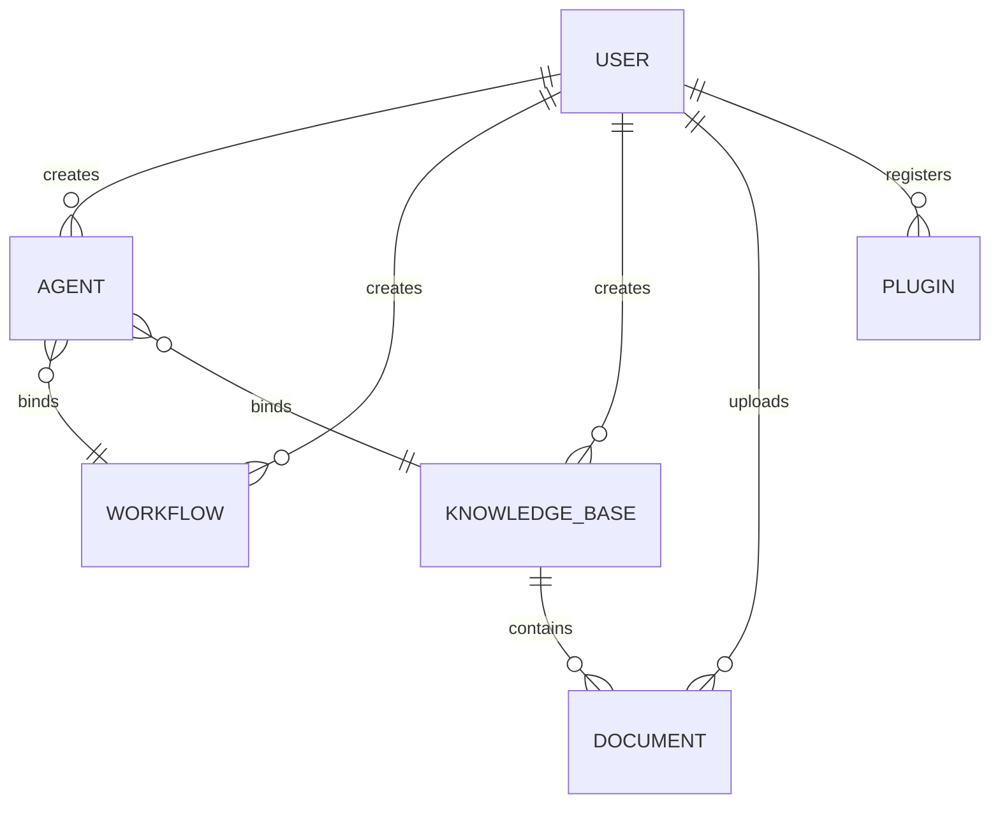

# 智能体创作平台数据库设计文档

## 1. 表设计概览

| 表名 | 核心功能 | 关联用户故事 |
|------|----------|--------------|
| `agent` | 存储智能体基本信息及配置 | US-001, US-002, US-003, US-004, US-005 |
| `workflow` | 存储工作流定义及状态 | US-011, US-012, US-013 |
| `knowledge_base` | 存储知识库基本信息 | US-006, US-008, US-010 |
| `document` | 存储知识库关联的文档信息 | US-007, US-008 |
| `plugin` | 存储插件注册信息及状态 | US-014, US-015 |

## 2. 详细表设计

### 2.1 agent 表（智能体表）

#### 设计理由
用于存储智能体的基本信息、配置及状态，支持智能体的创建、查询、更新、删除和发布等功能，对应智能体管理模块的所有用户故事。

#### 字段设计

| 字段名 | 类型 | 约束 | 含义 |
|--------|------|------|------|
| `id` | BIGINT | PRIMARY KEY, AUTO_INCREMENT | 智能体唯一标识 |
| `name` | VARCHAR(100) | NOT NULL | 智能体名称（必填，US-001 AC2） |
| `description` | TEXT | NULL | 智能体描述 |
| `prompt` | TEXT | NULL | 智能体提示词（US-003 编辑功能） |
| `status` | VARCHAR(20) | NOT NULL, DEFAULT 'draft' | 智能体状态（draft/published，US-001发布功能） |
| `user_id` | BIGINT | NOT NULL, FOREIGN KEY | 创建者ID（关联用户表，US-005 权限控制） |
| `workflow_id` | BIGINT | NULL, FOREIGN KEY | 绑定的工作流ID（关联workflow表，US-001配置功能） |
| `knowledge_base_id` | BIGINT | NULL, FOREIGN KEY | 绑定的知识库ID（关联knowledge_base表，US-001配置功能） |
| `create_time` | DATETIME | NOT NULL, DEFAULT CURRENT_TIMESTAMP | 创建时间 |
| `update_time` | DATETIME | NOT NULL, DEFAULT CURRENT_TIMESTAMP ON UPDATE CURRENT_TIMESTAMP | 更新时间（US-003编辑功能） |

#### 约束说明
- 联合唯一索引：`(user_id, name)` 确保同一用户下智能体名称不重复
- 状态枚举限制：`status` 只能为 `draft`（草稿）或 `published`（已发布）

### 2.2 workflow 表（工作流表）

#### 设计理由
用于存储工作流的定义、配置及状态，支持工作流的创建、执行和调试功能，对应工作流管理模块的用户故事。

#### 字段设计

| 字段名 | 类型 | 约束 | 含义 |
|--------|------|------|------|
| `id` | BIGINT | PRIMARY KEY, AUTO_INCREMENT | 工作流唯一标识 |
| `name` | VARCHAR(100) | NOT NULL | 工作流名称 |
| `description` | TEXT | NULL | 工作流描述 |
| `definition` | TEXT | NOT NULL | 工作流定义（JSON格式，存储节点和连线信息，US-011可视化设计） |
| `status` | VARCHAR(20) | NOT NULL, DEFAULT 'active' | 工作流状态（active/inactive） |
| `user_id` | BIGINT | NOT NULL, FOREIGN KEY | 创建者ID（关联用户表） |
| `create_time` | DATETIME | NOT NULL, DEFAULT CURRENT_TIMESTAMP | 创建时间 |
| `update_time` | DATETIME | NOT NULL, DEFAULT CURRENT_TIMESTAMP ON UPDATE CURRENT_TIMESTAMP | 更新时间 |

#### 约束说明
- 联合唯一索引：`(user_id, name)` 确保同一用户下工作流名称不重复
- `definition` 字段存储工作流的完整拓扑结构，包含节点类型、参数和连接关系

### 2.3 knowledge_base 表（知识库表）

#### 设计理由
用于存储知识库的基本信息，支持知识库的创建、查询和删除功能，对应知识库管理模块的用户故事。

#### 字段设计

| 字段名 | 类型 | 约束 | 含义 |
|--------|------|------|------|
| `id` | BIGINT | PRIMARY KEY, AUTO_INCREMENT | 知识库唯一标识 |
| `name` | VARCHAR(100) | NOT NULL | 知识库名称（必填，US-006 AC2） |
| `description` | TEXT | NULL | 知识库描述 |
| `user_id` | BIGINT | NOT NULL, FOREIGN KEY | 创建者ID（关联用户表，US-010权限控制） |
| `create_time` | DATETIME | NOT NULL, DEFAULT CURRENT_TIMESTAMP | 创建时间 |
| `update_time` | DATETIME | NOT NULL, DEFAULT CURRENT_TIMESTAMP ON UPDATE CURRENT_TIMESTAMP | 更新时间 |

#### 约束说明
- 联合唯一索引：`(user_id, name)` 确保同一用户下知识库名称不重复

### 2.4 document 表（文档表）

#### 设计理由
用于存储知识库中上传的文档信息及处理状态，支持文档上传、状态跟踪功能，对应知识库文档管理的用户故事。

#### 字段设计

| 字段名 | 类型 | 约束 | 含义 |
|--------|------|------|------|
| `id` | BIGINT | PRIMARY KEY, AUTO_INCREMENT | 文档唯一标识 |
| `file_name` | VARCHAR(255) | NOT NULL | 文档文件名 |
| `file_path` | VARCHAR(512) | NOT NULL | 文档存储路径 |
| `file_size` | BIGINT | NOT NULL | 文档大小（字节） |
| `file_type` | VARCHAR(50) | NOT NULL | 文档类型（txt/markdown，US-007格式校验） |
| `status` | VARCHAR(20) | NOT NULL, DEFAULT 'processing' | 处理状态（processing/completed/failed，US-007 AC4） |
| `knowledge_base_id` | BIGINT | NOT NULL, FOREIGN KEY | 所属知识库ID（关联knowledge_base表） |
| `user_id` | BIGINT | NOT NULL, FOREIGN KEY | 上传者ID（关联用户表） |
| `create_time` | DATETIME | NOT NULL, DEFAULT CURRENT_TIMESTAMP | 上传时间 |
| `update_time` | DATETIME | NOT NULL, DEFAULT CURRENT_TIMESTAMP ON UPDATE CURRENT_TIMESTAMP | 状态更新时间 |

#### 约束说明
- 状态枚举限制：`status` 只能为 `processing`（处理中）、`completed`（已完成）或 `failed`（失败）
- 外键级联：当知识库被删除时，关联文档同时删除（ON DELETE CASCADE）

### 2.5 plugin 表（插件表）

#### 设计理由
用于存储插件的注册信息、配置及状态，支持插件的注册、启用/禁用功能，对应插件管理模块的用户故事。

#### 字段设计

| 字段名 | 类型 | 约束 | 含义 |
|--------|------|------|------|
| `id` | BIGINT | PRIMARY KEY, AUTO_INCREMENT | 插件唯一标识 |
| `name` | VARCHAR(100) | NOT NULL | 插件名称（US-014 AC4） |
| `description` | TEXT | NULL | 插件描述 |
| `openapi_spec` | TEXT | NOT NULL | OpenAPI规范内容（JSON格式，US-014解析功能） |
| `status` | VARCHAR(20) | NOT NULL, DEFAULT 'disabled' | 插件状态（enabled/disabled，US-015切换功能） |
| `auth_info` | TEXT | NULL | 鉴权信息（JSON格式，存储API Key等） |
| `user_id` | BIGINT | NOT NULL, FOREIGN KEY | 注册者ID（关联用户表） |
| `create_time` | DATETIME | NOT NULL, DEFAULT CURRENT_TIMESTAMP | 创建时间 |
| `update_time` | DATETIME | NOT NULL, DEFAULT CURRENT_TIMESTAMP ON UPDATE CURRENT_TIMESTAMP | 更新时间 |

#### 约束说明
- 联合唯一索引：`(user_id, name)` 确保同一用户下插件名称不重复
- 状态枚举限制：`status` 只能为 `enabled`（启用）或 `disabled`（禁用）

## 3. 表关系说明

### 关键关系说明
1. **用户与资源的关系**：所有表通过 `user_id` 与用户表关联，实现资源的归属控制（如US-005仅允许删除自己的智能体）
2. **智能体与依赖资源的关系**：
   - `agent.workflow_id` 关联 `workflow.id`：实现智能体绑定工作流（US-001配置功能）
   - `agent.knowledge_base_id` 关联 `knowledge_base.id`：实现智能体绑定知识库（US-001配置功能）
3. **知识库与文档的关系**：`document.knowledge_base_id` 关联 `knowledge_base.id`，一个知识库可包含多个文档（US-007上传功能）
4. **外键约束策略**：
   - 智能体与工作流/知识库为松散关联（ON DELETE SET NULL）：删除工作流/知识库时仅解除绑定，不删除智能体
   - 知识库与文档为强关联（ON DELETE CASCADE）：删除知识库时同步删除关联文档（US-010 AC3）

## 4. 索引设计

| 表名 | 索引类型 | 索引字段 | 用途 |
|------|----------|----------|------|
| agent | 联合唯一索引 | (user_id, name) | 确保用户内名称唯一 |
| agent | 普通索引 | (user_id, status) | 快速查询用户的特定状态智能体 |
| workflow | 联合唯一索引 | (user_id, name) | 确保用户内名称唯一 |
| knowledge_base | 联合唯一索引 | (user_id, name) | 确保用户内名称唯一 |
| document | 普通索引 | (knowledge_base_id, status) | 快速查询知识库下的文档及状态 |
| plugin | 联合唯一索引 | (user_id, name) | 确保用户内名称唯一 |
| plugin | 普通索引 | (status) | 快速筛选启用的插件（US-015） |