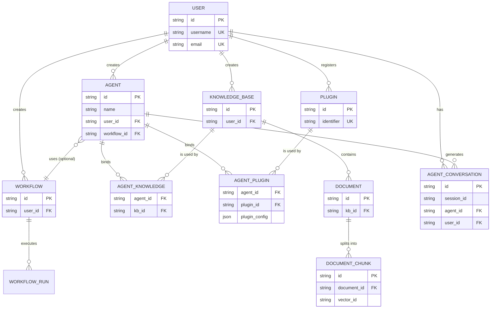

好的，已根据您的要求将表名 `agent_knowledge_base` 修改为 `agent_knowledge`，将 `agent_plugin_binding` 修改为 `agent_plugin`，并同步更新了全文所有的关联引用、ER 图和索引设计。

-----

# 智能体创作平台数据库设计文档

## 1\. 表设计概览

| 表名 | 核心功能 | 关联用户故事 |
|:---|:---|:---|
| user | 存储用户账号信息及认证数据 | US-019, US-020, US-021 |
| agent | 存储智能体基本信息及配置 | US-001, US-002, US-003, US-005, US-017 |
| agent\_knowledge | 存储智能体与知识库的关联关系 | US-001, US-010 |
| agent\_plugin | 存储智能体与插件的关联及运行配置 | US-001, US-016 |
| agent\_conversation | 存储智能体对话历史记录 | US-004, US-018 |
| workflow | 存储工作流定义、状态及编排数据 | US-011 |
| workflow\_run | 存储工作流执行历史、状态和调试信息 | US-012, US-013 |
| knowledge\_base | 存储知识库基本信息和元数据 | US-006, US-010 |
| document | 存储知识库关联的文档信息及处理状态 | US-007, US-008 |
| document\_chunk | 存储文档切片内容及向量映射信息 | US-007, US-009 |
| plugin | 存储插件注册信息及状态 | US-014, US-015 |
| system\_config | 存储系统全局配置信息 | US-022 |
| system\_log | 存储系统操作日志及审计信息 | US-023 |

## 2\. 详细表设计

### 2.1 user 表（用户表）

#### 设计理由

用于存储用户的账号信息、认证数据及个人资料，是系统所有资源的权限控制基础。

#### 字段设计

| 字段名 | 类型 | 约束 | 含义 |
|:---|:---|:---|:---|
| id | VARCHAR(64) | PRIMARY KEY | 用户唯一标识 |
| username | VARCHAR(50) | NOT NULL, UNIQUE | 用户名 |
| email | VARCHAR(100) | NOT NULL, UNIQUE | 邮箱地址 |
| password | VARCHAR(255) | NOT NULL | 密码（加密存储） |
| nickname | VARCHAR(100) | NULL | 昵称 |
| avatar | VARCHAR(512) | NULL | 头像URL |
| bio | TEXT | NULL | 个人简介 |
| role | VARCHAR(20) | NOT NULL, DEFAULT 'user' | 用户角色 |
| status | VARCHAR(20) | NOT NULL, DEFAULT 'active' | 账户状态 |
| email\_verified | BOOLEAN | NOT NULL, DEFAULT FALSE | 邮箱是否已验证 |
| login\_attempts | INT | NOT NULL, DEFAULT 0 | 登录失败次数 |
| locked\_until | DATETIME | NULL | 账户锁定截止时间 |
| last\_login\_time | DATETIME | NULL | 最后登录时间 |
| create\_time | DATETIME | NOT NULL, DEFAULT CURRENT\_TIMESTAMP | 创建时间 |
| update\_time | DATETIME | NOT NULL, DEFAULT CURRENT\_TIMESTAMP ON UPDATE CURRENT\_TIMESTAMP | 更新时间 |

#### 约束说明

  - 唯一索引：username 和 email 字段必须全局唯一，以保证账户的唯一性。
  - 密码安全：password 字段应存储经过哈希和加盐处理（如 bcrypt）的密码，绝不能存储明文。
  - 枚举限制：role 字段值限于 user, admin；status 字段值限于 active, locked, inactive。
  - 登录安全：通过 login\_attempts 和 locked\_until 字段实现登录失败次数限制和账户临时锁定机制。

### 2.2 agent 表（智能体表）

#### 设计理由

存储智能体的核心定义、配置和发布状态。支持智能体的创建、查看、编辑、删除和发布。

#### 字段设计

| 字段名 | 类型 | 约束 | 含义 |
|:---|:---|:---|:---|
| id | VARCHAR(64) | PRIMARY KEY | 智能体唯一标识 |
| name | VARCHAR(100) | NOT NULL | 智能体名称 |
| description | TEXT | NULL | 智能体描述 |
| prompt | TEXT | NULL | 智能体提示词 |
| model\_config | JSON | NULL | 模型配置（model, temperature等） |
| status | VARCHAR(20) | NOT NULL, DEFAULT 'draft' | 状态（draft/published） |
| user\_id | VARCHAR(64) | NOT NULL, FOREIGN KEY | 创建者ID |
| workflow\_id | VARCHAR(64) | NULL, FOREIGN KEY | 绑定的工作流ID |
| published\_at | DATETIME | NULL | 发布时间 |
| create\_time | DATETIME | NOT NULL, DEFAULT CURRENT\_TIMESTAMP | 创建时间 |
| update\_time | DATETIME | NOT NULL, DEFAULT CURRENT\_TIMESTAMP ON UPDATE CURRENT\_TIMESTAMP | 更新时间 |
| deleted\_at | DATETIME | NULL | 软删除时间 |

#### 约束说明

  - 联合唯一索引：(user\_id, name) 确保同一用户下的智能体名称不重复。
  - 外键关联：workflow\_id 关联 workflow(id)，设置为 ON DELETE SET NULL，删除工作流时不影响智能体本身。
  - 软删除：通过 deleted\_at 字段实现软删除，便于恢复。
  - 枚举限制：status 字段值限于 draft, published。

### 2.3 agent\_knowledge 表（智能体-知识库关联表）

#### 设计理由

用于解决智能体与知识库之间的多对多关系，支持引用完整性检查和高效的反向查询。

#### 字段设计

| 字段名 | 类型 | 约束 | 含义 |
|:---|:---|:---|:---|
| id | BIGINT | PRIMARY KEY, AUTO\_INCREMENT | 自增主键 |
| agent\_id | VARCHAR(64) | NOT NULL, FOREIGN KEY | 智能体ID |
| kb\_id | VARCHAR(64) | NOT NULL, FOREIGN KEY | 知识库ID |
| create\_time | DATETIME | NOT NULL, DEFAULT CURRENT\_TIMESTAMP | 绑定时间 |

#### 约束说明

  - 联合唯一索引：(agent\_id, kb\_id) 确保绑定关系的唯一性。
  - 外键级联：建议配置 ON DELETE CASCADE，当任一关联实体（智能体或知识库）被物理删除时，自动清理关联关系。
  - 查询优化：利用 (kb\_id) 索引加速删除知识库时的引用检查。

### 2.4 agent\_plugin 表（智能体-插件关联表）

#### 设计理由

用于解决智能体与插件之间的多对多关系，并允许为每个智能体独立配置插件的运行参数。

#### 字段设计

| 字段名 | 类型 | 约束 | 含义 |
|:---|:---|:---|:---|
| id | BIGINT | PRIMARY KEY, AUTO\_INCREMENT | 自增主键 |
| agent\_id | VARCHAR(64) | NOT NULL, FOREIGN KEY | 智能体ID |
| plugin\_id | VARCHAR(64) | NOT NULL, FOREIGN KEY | 插件ID |
| plugin\_config | JSON | NULL | 运行时配置（参数默认值等） |
| is\_enabled | BOOLEAN | NOT NULL, DEFAULT TRUE | 在该智能体中是否启用 |
| create\_time | DATETIME | NOT NULL, DEFAULT CURRENT\_TIMESTAMP | 绑定时间 |

#### 约束说明

  - 联合唯一索引：(agent\_id, plugin\_id) 确保绑定关系的唯一性。
  - 配置隔离：plugin\_config 字段存储智能体特有的插件配置。
  - 状态控制：is\_enabled 允许在不解除绑定的情况下控制插件的激活状态。

### 2.5 agent\_conversation 表（智能体对话历史表）

#### 设计理由

分离存储智能体的对话历史，支持按会话聚合消息。

#### 字段设计

| 字段名 | 类型 | 约束 | 含义 |
|:---|:---|:---|:---|
| id | VARCHAR(64) | PRIMARY KEY | 对话记录ID |
| session\_id | VARCHAR(64) | NOT NULL | 会话ID（聚合多轮对话） |
| agent\_id | VARCHAR(64) | NOT NULL, FOREIGN KEY | 智能体ID |
| user\_id | VARCHAR(64) | NOT NULL, FOREIGN KEY | 用户ID |
| query | TEXT | NOT NULL | 用户提问 |
| answer | LONGTEXT | NOT NULL | 智能体回答 |
| metadata | JSON | NULL | 元数据（引用来源、Token消耗） |
| conversation\_type | VARCHAR(20) | NOT NULL | 类型（chat/debug） |
| create\_time | DATETIME | NOT NULL, DEFAULT CURRENT\_TIMESTAMP | 创建时间 |

#### 约束说明

  - 性能优化：必须在 (session\_id, create\_time) 上建立复合索引，以保证加载历史聊天记录的性能。
  - 枚举限制：conversation\_type 字段值限于 chat, debug。
  - 级联清理：当用户或智能体被物理删除时，相关的对话记录应一并删除。

### 2.6 workflow 表（工作流表）

#### 设计理由

存储工作流的静态定义，包括节点、连线和画布布局信息，支持可视化编排。

#### 字段设计

| 字段名 | 类型 | 约束 | 含义 |
|:---|:---|:---|:---|
| id | VARCHAR(64) | PRIMARY KEY | 工作流ID |
| name | VARCHAR(100) | NOT NULL | 名称 |
| description | TEXT | NULL | 描述 |
| definition | JSON | NOT NULL | 逻辑定义（DSL） |
| graph\_data | JSON | NULL | 画布UI数据 |
| is\_valid | BOOLEAN | NOT NULL, DEFAULT FALSE | DAG校验状态 |
| user\_id | VARCHAR(64) | NOT NULL, FOREIGN KEY | 创建者ID |
| create\_time | DATETIME | NOT NULL, DEFAULT CURRENT\_TIMESTAMP | 创建时间 |
| update\_time | DATETIME | NOT NULL, DEFAULT CURRENT\_TIMESTAMP ON UPDATE CURRENT\_TIMESTAMP | 更新时间 |

#### 约束说明

  - 联合唯一索引：(user\_id, name) 确保同一用户下的工作流名称不重复。
  - 数据一致性：is\_valid 字段记录后端 DAG 校验结果，确保执行的工作流拓扑合法。
  - JSON结构：definition 存储后端执行逻辑；graph\_data 存储前端可视化信息。

### 2.7 workflow\_run 表（工作流执行历史表）

#### 设计理由

记录工作流的每一次动态执行实例，包括完整运行和单节点调试，支持状态跟踪和结果回溯。

#### 字段设计

| 字段名 | 类型 | 约束 | 含义 |
|:---|:---|:---|:---|
| id | VARCHAR(64) | PRIMARY KEY | 执行记录ID |
| workflow\_id | VARCHAR(64) | NOT NULL, FOREIGN KEY | 工作流ID |
| user\_id | VARCHAR(64) | NOT NULL, FOREIGN KEY | 执行者ID |
| status | VARCHAR(20) | NOT NULL | 状态 |
| inputs | JSON | NULL | 初始输入 |
| outputs | JSON | NULL | 最终输出 |
| error | TEXT | NULL | 错误信息 |
| node\_states | JSON | NULL | 节点执行快照 |
| run\_type | VARCHAR(20) | NOT NULL | 类型（full/debug） |
| start\_time | DATETIME | NULL | 开始时间 |
| end\_time | DATETIME | NULL | 结束时间 |

#### 约束说明

  - 枚举限制：status 字段值限于 pending, running, completed, failed, terminated；run\_type 限于 full, debug。
  - 历史不可变：执行记录一旦生成，原则上只读，不可修改。
  - 调试支持：node\_states 存储各节点的执行快照，是实现单节点调试和完整执行过程追溯的核心。

### 2.8 knowledge\_base 表（知识库表）

#### 设计理由

存储知识库的元信息，是 RAG（检索增强生成）系统的核心容器。

#### 字段设计

| 字段名 | 类型 | 约束 | 含义 |
|:---|:---|:---|:---|
| id | VARCHAR(64) | PRIMARY KEY | 知识库ID |
| name | VARCHAR(100) | NOT NULL | 名称 |
| description | TEXT | NULL | 描述 |
| embedding\_model | VARCHAR(100) | NULL | 向量模型 |
| file\_count | INT | NOT NULL, DEFAULT 0 | 文档数量（冗余字段） |
| user\_id | VARCHAR(64) | NOT NULL, FOREIGN KEY | 创建者ID |
| create\_time | DATETIME | NOT NULL, DEFAULT CURRENT\_TIMESTAMP | 创建时间 |
| update\_time | DATETIME | NOT NULL, DEFAULT CURRENT\_TIMESTAMP ON UPDATE CURRENT\_TIMESTAMP | 更新时间 |
| deleted\_at | DATETIME | NULL | 软删除时间 |

#### 约束说明

  - 联合唯一索引：(user\_id, name) 确保同一用户下的知识库名称唯一。
  - 模型一致性：embedding\_model 字段一旦设定，应保持不变，以确保知识库内所有文档处于同一向量空间。
  - 软删除：通过 deleted\_at 字段实现逻辑删除。

### 2.9 document 表（文档表）

#### 设计理由

存储知识库中的文档文件信息、处理状态和元数据。

#### 字段设计

| 字段名 | 类型 | 约束 | 含义 |
|:---|:---|:---|:---|
| id | VARCHAR(64) | PRIMARY KEY | 文档ID |
| filename | VARCHAR(255) | NOT NULL | 文件名 |
| file\_path | VARCHAR(512) | NOT NULL | 存储路径 |
| file\_size | BIGINT | NOT NULL | 文件大小 |
| file\_type | VARCHAR(50) | NOT NULL | 文件类型 |
| chunk\_count | INT | NOT NULL, DEFAULT 0 | 切片数量 |
| status | VARCHAR(20) | NOT NULL | 状态 |
| error\_msg | TEXT | NULL | 失败原因 |
| knowledge\_base\_id | VARCHAR(64) | NOT NULL, FOREIGN KEY | 知识库ID |
| user\_id | VARCHAR(64) | NOT NULL, FOREIGN KEY | 上传者ID |
| create\_time | DATETIME | NOT NULL, DEFAULT CURRENT\_TIMESTAMP | 创建时间 |
| update\_time | DATETIME | NOT NULL, DEFAULT CURRENT\_TIMESTAMP ON UPDATE CURRENT\_TIMESTAMP | 更新时间 |
| deleted\_at | DATETIME | NULL | 软删除时间 |

#### 约束说明

  - 性能索引：(knowledge\_base\_id, status) 索引用于快速查询知识库下的文档列表及其处理状态。
  - 状态流转：status 字段值限于 processing, completed, failed。
  - 级联删除：当所属知识库被物理删除时，文档及其切片应被级联删除。

### 2.10 document\_chunk 表（文档切片表）

#### 设计理由

存储文档切分后的详细文本块信息，用于 RAG 检索的精准溯源、调试和上下文组装。

#### 字段设计

| 字段名 | 类型 | 约束 | 含义 |
|:---|:---|:---|:---|
| id | VARCHAR(64) | PRIMARY KEY | 切片唯一ID |
| document\_id | VARCHAR(64) | NOT NULL, FOREIGN KEY | 所属文档ID |
| content | LONGTEXT | NOT NULL | 切片文本内容 |
| chunk\_index | INT | NOT NULL | 在文档中的序号 |
| token\_count | INT | NULL | Token 数量估算 |
| vector\_id | VARCHAR(64) | NULL | 外部向量库对应ID |
| create\_time | DATETIME | NOT NULL, DEFAULT CURRENT\_TIMESTAMP | 创建时间 |

#### 约束说明

  - 性能索引：(document\_id, chunk\_index) 索引用于按顺序读取文档全文或在删除文档时快速定位所有切片。
  - RAG 映射：vector\_id 字段是关系数据与外部向量数据库中的向量数据的唯一关联键。
  - 数据完整性：当所属文档被删除时，切片数据应被级联删除。

### 2.11 plugin 表（插件表）

#### 设计理由

存储插件的注册信息、OpenAPI 规范定义和基础配置，作为智能体的可扩展能力。

#### 字段设计

| 字段名 | 类型 | 约束 | 含义 |
|:---|:---|:---|:---|
| id | VARCHAR(64) | PRIMARY KEY | 插件ID |
| name | VARCHAR(100) | NOT NULL | 名称 |
| identifier | VARCHAR(100) | NULL, UNIQUE | 唯一标识符 |
| description | TEXT | NULL | 描述 |
| openapi\_spec | JSON | NOT NULL | OpenAPI 规范 |
| status | VARCHAR(20) | NOT NULL, DEFAULT 'disabled' | 状态 |
| auth\_info | TEXT | NULL | 鉴权信息 |
| auth\_type | VARCHAR(20) | NULL, DEFAULT 'none' | 鉴权类型 |
| user\_id | VARCHAR(64) | NULL, FOREIGN KEY | 注册者ID |
| create\_time | DATETIME | NOT NULL, DEFAULT CURRENT\_TIMESTAMP | 创建时间 |
| update\_time | DATETIME | NOT NULL, DEFAULT CURRENT\_TIMESTAMP ON UPDATE CURRENT\_TIMESTAMP | 更新时间 |

#### 约束说明

  - 数据安全：auth\_info 字段必须在应用层加密存储，以保护 API Key 等敏感信息。
  - 全局标识：identifier 必须全局唯一，作为插件在系统内部调用的关键标识。
  - 索引优化：(status) 索引用于快速筛选已启用的插件。

### 2.12 system\_log 表（系统日志表）

#### 设计理由

存储系统操作日志及审计信息，用于问题排查和行为审计。

#### 字段设计

| 字段名 | 类型 | 约束 | 含义 |
|:---|:---|:---|:---|
| id | VARCHAR(64) | PRIMARY KEY | 日志ID |
| user\_id | VARCHAR(64) | NULL, FOREIGN KEY | 操作人ID |
| module | VARCHAR(50) | NOT NULL | 模块 |
| action | VARCHAR(50) | NOT NULL | 动作 |
| level | VARCHAR(20) | NOT NULL, DEFAULT 'info' | 级别 |
| content | TEXT | NULL | 详情 |
| request\_params | JSON | NULL | 参数快照 |
| create\_time | DATETIME | NOT NULL, DEFAULT CURRENT\_TIMESTAMP | 创建时间 |

#### 约束说明

  - 索引优化：(create\_time) 和 (module, action) 索引用于优化日志的查询和筛选性能。
  - 高频写入：此表为高频写入表，生产环境建议考虑分区或定期归档策略。

### 2.13 system\_config 表（系统配置表）

#### 设计理由

存储系统全局配置信息，如默认模型、系统级 API 密钥等。

#### 字段设计

| 字段名 | 类型 | 约束 | 含义 |
|:---|:---|:---|:---|
| id | VARCHAR(64) | PRIMARY KEY | ID |
| config\_key | VARCHAR(100) | NOT NULL, UNIQUE | 配置键 |
| config\_value | TEXT | NOT NULL | 配置值 |
| description | VARCHAR(255) | NULL | 说明 |
| create\_time | DATETIME | NOT NULL | 创建时间 |
| update\_time | DATETIME | NOT NULL | 更新时间 |

#### 约束说明

  - 唯一索引：config\_key 必须唯一，确保配置项不重复。
  - 性能优化：此表为高频读取表，建议在应用层增加缓存机制以提升性能。

## 3\. 表关系说明 (ER 图)

## 关键关系说明

### 用户与资源的关系

所有核心资源表（agent, workflow, knowledge\_base, document, plugin）均通过 user\_id 与 user 表关联，以此确立资源的归属，是实现多租户数据隔离和权限控制的基础。

### 智能体与依赖资源的关系

  - 多对多关联（知识库）：agent 与 knowledge\_base 之间通过 agent\_knowledge 中间表关联。这种设计支持一个智能体绑定多个知识库，同时利用中间表索引实现删除知识库时的快速引用检查。
  - 多对多关联（插件）：agent 与 plugin 之间通过 agent\_plugin 中间表关联。plugin\_config 字段存储于中间表，实现了配置的隔离与复用。
  - 一对一关联（工作流）：agent.workflow\_id 关联 workflow.id。这种松耦合的设计允许工作流作为模板被多个智能体复用。
  - 模型配置：agent.model\_config 字段支持为智能体独立配置大模型参数，实现个性化响应。

### 工作流设计

workflow 表与 agent 表是解耦的，workflow.graph\_data 存储画布的可视化数据，用于前端编辑器回显，实现所见即所得的编排体验。

### 知识库与文档的关系（RAG）

  - 分层结构：知识库（knowledge\_base）包含文档（document），文档又被切分为切片（document\_chunk）。
  - RAG 核心：document\_chunk 记录了文本块内容和 vector\_id，建立了关系数据与外部向量数据之间的映射，确保 RAG 检索结果的溯源和精准性。

### 插件系统

  - plugin.identifier 作为全局唯一的业务标识符，供系统内部可靠引用。
  - 具体的插件调用参数和启用状态由 agent\_plugin 表控制。

### 系统日志与审计

  - system\_log.user\_id 关联具体操作的用户，为行为审计提供明确主体。
  - system\_log.request\_params 存储关键操作的请求参数快照，用于问题排查和安全追溯。

### 约束策略

  - 松散关联（ON DELETE SET NULL）：agent 与 workflow 关联，当工作流被删除时，仅将 agent.workflow\_id 置为 NULL，不影响智能体本身。
  - 强关联（ON DELETE CASCADE）：knowledge\_base 与 document 以及 document 与 document\_chunk 之间应采用级联删除，确保数据完整性。
  - 引用保护：删除核心资源（如知识库）前，必须通过查询关联表（如 agent\_knowledge）进行引用检查。
  - 软删除：核心业务表通过 deleted\_at 字段实现软删除，提供数据恢复能力。

## 4\. 索引设计

| 表名 | 索引类型 | 索引字段 | 优化用途 |
| :--- | :--- | :--- | :--- |
| user | 唯一索引 | (username) | 确保用户名唯一，支持用户名登录。 |
| user | 唯一索引 | (email) | 确保邮箱唯一，支持邮箱登录。 |
| user | 普通索引 | (status) | 快速查询特定状态的用户。 |
| agent | 联合唯一索引 | (user\_id, name) | 确保用户内名称唯一。 |
| agent | 普通索引 | (user\_id, status) | 快速查询用户的特定状态智能体列表。 |
| agent\_knowledge | 联合唯一索引 | (agent\_id, kb\_id) | 确保绑定关系的唯一性。 |
| agent\_knowledge | 普通索引 | (kb\_id) | 关键：加速反向查询，用于知识库删除保护。 |
| agent\_plugin | 联合唯一索引 | (agent\_id, plugin\_id) | 确保绑定关系的唯一性。 |
| agent\_conversation | 复合索引 | (session\_id, create\_time) | 关键：快速加载特定会话的所有历史消息，保证顺序。 |
| agent\_conversation | 普通索引 | (agent\_id, user\_id, create\_time) | 快速查询特定智能体或用户的对话历史记录。 |
| workflow | 联合唯一索引 | (user\_id, name) | 确保用户内名称唯一。 |
| workflow | 普通索引 | (user\_id) | 快速查询用户创建的所有工作流列表。 |
| workflow\_run | 普通索引 | (workflow\_id, create\_time) | 快速查询某个工作流的所有执行历史。 |
| knowledge\_base | 联合唯一索引 | (user\_id, name) | 确保用户内名称唯一。 |
| document | 普通索引 | (knowledge\_base\_id, status) | 快速查询知识库下的文档列表及其处理状态。 |
| document\_chunk | 普通索引 | (document\_id, chunk\_index) | 用于按顺序读取文档切片内容，或快速清理切片。 |
| document\_chunk | 普通索引 | (vector\_id) | 用于 RAG 检索后，根据外部向量 ID 快速反查文本内容。 |
| plugin | 唯一索引 | (identifier) | 确保插件标识符全局唯一，用于系统内部可靠引用。 |
| plugin | 普通索引 | (status) | 快速筛选启用的插件。 |
| system\_log | 普通索引 | (create\_time) | 按时间范围查询日志。 |
| system\_log | 普通索引 | (module, action) | 按模块和操作类型筛选日志。 |
| system\_log | 普通索引 | (user\_id) | 按用户查询操作历史。 |
| system\_config | 唯一索引 | (config\_key) | 确保配置键唯一。 |

